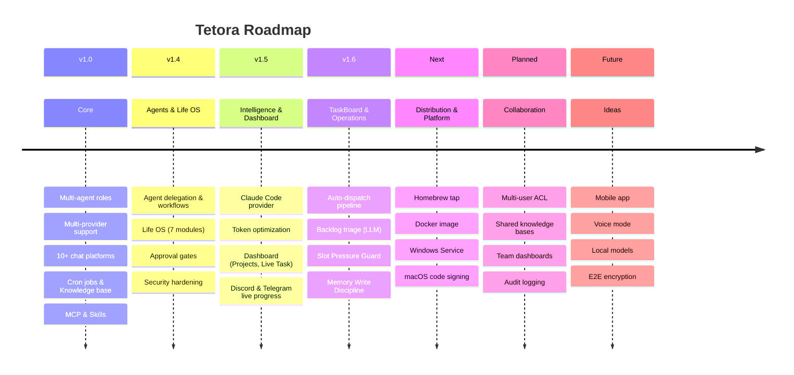

# Tetora Roadmap

This is a high-level overview of shipped and planned features. Priorities may shift based on community feedback.

> **Legend:** v1.0–v1.6 = shipped &nbsp;|&nbsp; Next / Planned / Future = not yet shipped &nbsp;|&nbsp; ✅ in text sections = completed items
>
> *Can't see the diagram? View the [PNG version](assets/roadmap.png) or [PDF version](assets/roadmap.pdf).*

---

## v1.0 — Core ✅

- [x] Multi-agent roles with soul files
- [x] Multi-provider support (Claude API, OpenAI, Gemini, OpenAI-compatible)
- [x] 10+ chat platforms (Telegram, Discord, Slack, LINE, Teams, Signal, WhatsApp, iMessage, Google Chat, Matrix)
- [x] Cron jobs with approval gates and notifications
- [x] Knowledge base for grounded responses
- [x] MCP support (Model Context Protocol servers as tool providers)
- [x] Skills and workflow pipelines
- [x] Webhooks, cost governance, data retention

## v1.4 — Advanced Agents & Life OS ✅

### Agents & Orchestration

- [x] Agent-to-agent delegation
- [x] Workflow orchestration (DAG engine, condition, parallel, handoff, retry)
- [x] Agentic loop with tool execution, token/cost accumulation
- [x] Approval gates — Telegram (inline keyboard), Discord (buttons), Slack (text-based)
- [ ] Custom tool development SDK
- [ ] Plugin marketplace

### Life OS

- [x] Contacts & social graph (cross-channel, birthday, inactivity tracking)
- [x] Habits & wellness tracking (streaks, health webhook, reports)
- [x] Goals & milestones (decomposition, weekly review)
- [x] Smart scheduling (free slot finding, overcommitment detection)
- [x] Life insights engine (behavioral analysis, anomaly detection, spending forecast)
- [x] Morning briefing & evening wrap
- [x] Quick capture (keyword classifier: expense/reminder/contact/task/idea/note)
- [x] Time tracking with report aggregation
- [x] Lifecycle engine (cross-module automation)

### Security & Hardening

- [x] Crash protection & panic recovery (HTTP middleware, tool execution)
- [x] Injection defense (fail-closed mode)
- [x] SQLite selective encryption (AES-256-GCM)
- [x] Skill install + Sentori security scanner (24 regex rules, 5 risk categories)
- [x] Tool filtering per role, output truncation, execution timeout
- [x] Budget & context mid-loop checks
- [x] Audio normalization tool (ffmpeg loudnorm)
- [x] Lightweight onboarding wizard (3-step CLI flow)
- [x] Shell completion (bash, zsh, fish)
- [x] Config validation (`tetora config validate`)

## v1.5 — Intelligence & Dashboard ✅

### Provider & Dispatch

- [x] Claude Code provider + token optimization + tiered prompts
- [x] Smart timeout estimation + dispatch subtasks
- [x] Budget soft-limit + provider fallback chain
- [x] Zombie session cleanup

### Dashboard

- [x] System Log session + Live Task view
- [x] Workspace tab with Projects management
- [x] Folder browser + batch project import

### Platform

- [x] Discord: thread-per-task notifications + live progress streaming
- [x] Telegram: live progress streaming
- [x] `tetora restart` command

### Codebase

- [x] role → agent terminology rename across codebase
- [x] CI pipeline (.github/workflows/ci.yml) + green build
- [x] Multi-language install guide (10 languages)

## v1.6 — TaskBoard & Operations ✅

### TaskBoard

- [x] Auto-dispatch pipeline (todo → doing → done/failed)
- [x] Backlog triage — LLM-powered analysis (ready/decompose/clarify)
- [x] Dashboard TaskBoard UI
- [x] TaskBoard config toggle

### Agent System

- [x] Agent World pixel sprites
- [x] Memory Write Discipline (HaluMem guard: fabrication, inaccuracy, contradiction, omission)
- [x] Tiered SKILL.md injection + metadata auto-generation
- [x] Slot Pressure Guard (protect interactive sessions from batch saturation)

### Operations

- [x] Safe upgrade (skip auto-restart when jobs running)
- [x] roles→agents config migration + backward compatibility
- [x] Sub-agent deadlock fix (separate child semaphore)
- [x] Discord session reuse fix + live streaming progress

## Next — Distribution & Platform

- [ ] Homebrew tap (`brew install TakumaLee/tap/tetora`)
- [ ] Docker image (`docker run -v ~/.tetora:/data tetora`)
- [ ] Windows Service management
- [ ] Linux .rpm package
- [ ] macOS code signing and notarization
- [ ] ARM32 Linux support (Raspberry Pi)

## Planned — Collaboration

- [ ] Multi-user support with access control
- [ ] Shared knowledge bases
- [ ] Team dashboards
- [ ] Audit logging

## Future Ideas

- Mobile companion app (iOS/Android)
- Voice interaction mode
- Local model support (Ollama, llama.cpp)
- End-to-end encryption for conversations

---

Have a feature request? [Open an issue](https://github.com/TakumaLee/Tetora/issues).
